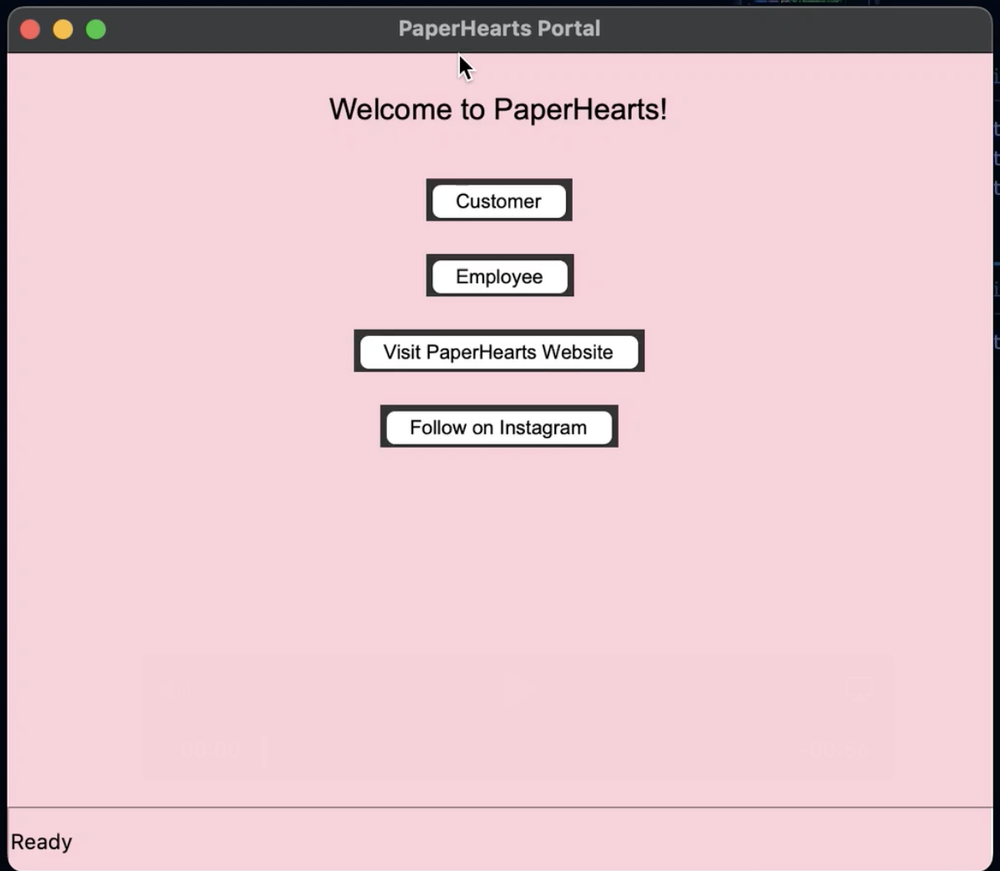
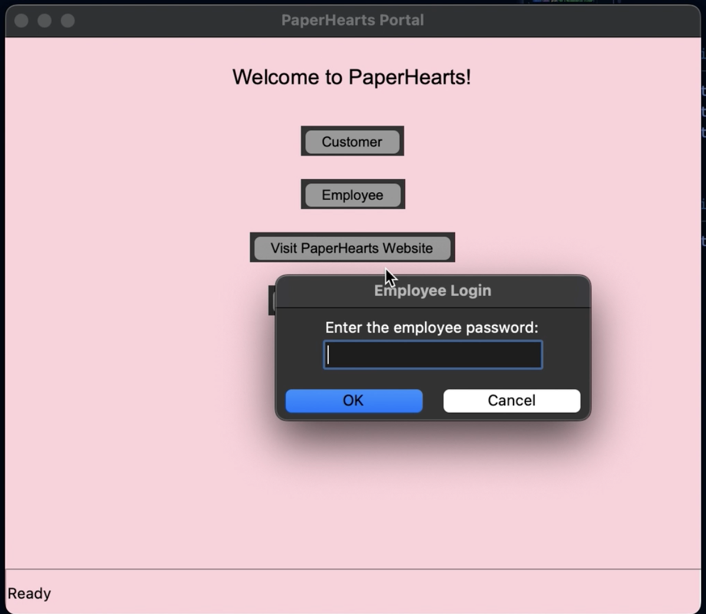
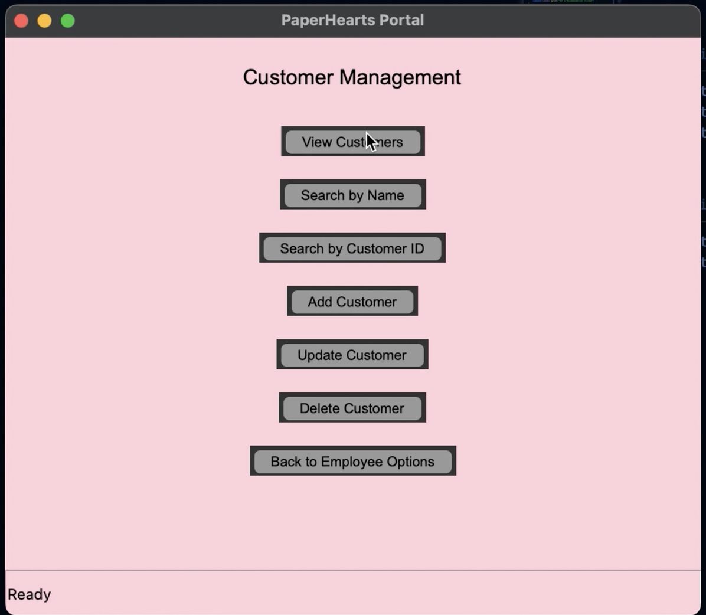
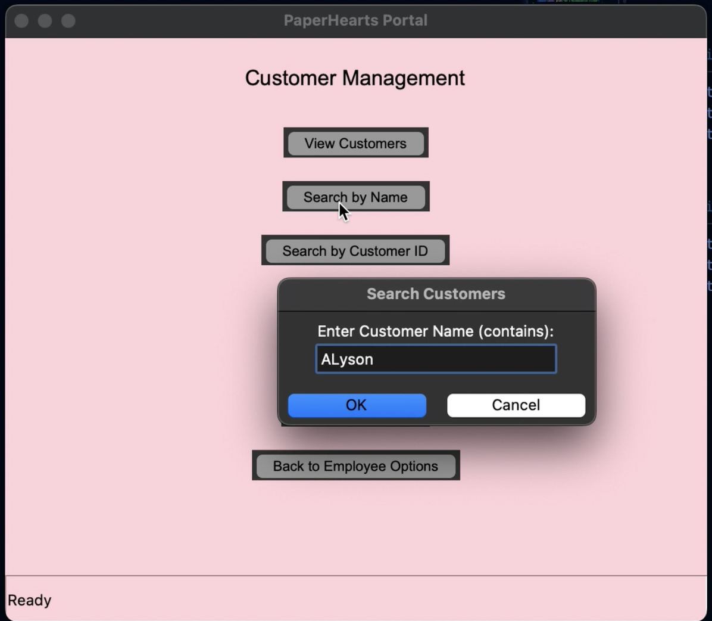
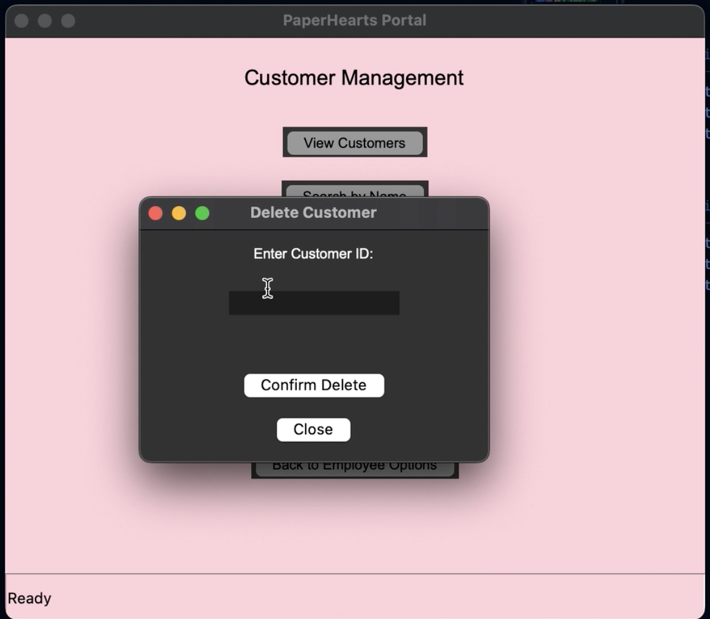

<p align="center">
  
</p>

Paper Hearts GUI Coding and Creation 📚
---

The goal of the assignment was to create a GUI interface that could recommend books to customers of the bookstore. The assignment instructions required the project to run 
on API endpoints. Data cleaning took place in Excel prior to coding in VSCode. 

---

## Database Creation 🌟
---
A SQLite database was created from the Excel worksheet of the data. First, the database/dataframe was created along with tables for each of the Excel worksheets we would be 
loading into our database. 


<details>
  <summary>🔍 View Database Connection code</summary>

```python
import pandas as pd
from pathlib import Path
import sqlite3
import uuid

Set the path of where to find the data files
RAW_DATA_PATH = Path(__file__).parent / 'data'

Set the path of where to save the SQLite database
DATABASE_PATH = Path(__file__).parents[1] / 'data'
 # Create the tables in the SQLite database
    create_tables()

 # Create a SQLite database and write the dataframes to the database
    with sqlite3.connect(DATABASE_PATH / 'paperhearts.db') as conn:
        items.to_sql('Items', conn, if_exists='replace', index=False)
        transactions.to_sql('Transactions', conn, if_exists='replace', index=False)
        customers.to_sql('Customers', conn, if_exists='replace', index=False)
        print('Data loaded successfully!')

```
</details>
<details>
  <summary>🔍 View Table Creation Code</summary>

```python
def create_tables():
    # Create a SQLite database connection
    with sqlite3.connect(DATABASE_PATH / 'paperhearts.db') as conn:
        cursor = conn.cursor()

        # Create the tables in the database
        cursor.execute('''DROP TABLE IF EXISTS Items''')
        cursor.execute(''' 
            CREATE TABLE IF NOT EXISTS Items (
                Token VARCHAR (50),
                Category VARCHAR (50),
                PRICE_POINT_NAME VARCHAR (50),
                SKU VARCHAR (50),
                GROSS_SALES INT
            )
        ''')

        cursor.execute('''DROP TABLE IF EXISTS Transactions''')
        cursor.execute(''' 
            CREATE TABLE IF NOT EXISTS Transactions (
                Transaction_ID VARCHAR(50),
                Date DATE,
                Time TIME,
                Qty INT,
                Discounts INT,
                Net_Sales INT,
                Tax INT,
                Payment_ID INT,
                Device_Name TEXT,
                Details TEXT,
                Event_Type TEXT,
                Customer_ID INT,
                Unit TEXT,
                Count INT,
                Itemization TEXT,
                Employee TEXT,
                Token INT
            )
        ''')

        cursor.execute('''DROP TABLE IF EXISTS Customers''')
        cursor.execute(''' 
            CREATE TABLE IF NOT EXISTS Customers (
                Customer_ID VARCHAR (50),
                Customer_Name TEXT,
                Email TEXT,
                Customer_Phone TEXT,
                Category_Preferences TEXT
            )
        ''')
        print('Tables created successfully!')
```
</details>

After creating the database and tables, the data was loaded into the database so it could be used. A test was created to ensure the data was correctly loaded into the database prior to querying.

<details>
  <summary>🔍 View Data Load Code</summary>

```python
# Load the data into the SQLite database
def load_data():
    # Read the data files into pandas dataframes
    items = pd.read_csv(RAW_DATA_PATH / 'Items.csv', encoding='ISO-8859-1')
    transactions = pd.read_csv(RAW_DATA_PATH / 'Transactions.csv')
    customers = pd.read_csv(RAW_DATA_PATH / 'Customers.csv')

def test_data_load():
    # Query the database to make sure the data was loaded
    with sqlite3.connect(DATABASE_PATH / 'paperhearts.db') as conn:
        query = 'SELECT * FROM Customers'
        items = pd.read_sql(query, conn)
        print(items.head())

if __name__ == '__main__':
    load_data()
    update_customer_preferences()
    test_data_load()
```
</details>


## API Endpoint Creation 🕸️
---

To create our API endpoints, three different coding files were created, API models, routes, and services. 

**API Models** 📷
---
The API models section is where we defined the classes for our data. In total, we have three classes in our project, Item, Transaction, and Customer. 

<details>
  <summary>🔍 View API Models Code</summary>

```python
class Item:
    
    def __init__(self, token: str, category: str, item: str, price_point_name: str, SKU: str, gross_sales: float):
        self.token = token
        self.category = category
        self.item = item
        self.price_point_name = price_point_name
        self.SKU = SKU
        self.gross_sales = gross_sales

    def __repr__(self):
        return f'<Token {self.token} - {self.item}>'
    
    def to_dict(self):
        return {
            'Token' : self.token,
            'Category': self.category,
            'Item': self.item,
            'Price_Point_Name': self.price_point_name,
            'SKU': self.SKU,
            'Gross_Sales': self.gross_sales
        }
    
class Simple_Item:
    
    def __init__(self, category: str, item: str, gross_sales: float):
        self.category = category
        self.item = item
        self.gross_sales = gross_sales

    def __repr__(self):
        return f'<Item {self.item}>'
    
    def to_dict(self):
        return {
            'Category': self.category,
            'Item': self.item,
            'Gross_Sales': self.gross_sales
        }
    
class Customer:
    
    def __init__(self, customer_id: int, customer_name: str, customer_email: str, customer_phone: str, category_preferences: str):
        self.customer_id = customer_id
        self.customer_name = customer_name
        self.customer_email = customer_email
        self.customer_phone = customer_phone
        self.category_preferences = category_preferences

    def __repr__(self):
        return f'<Customer {self.customer_id} - {self.customer_name}>'
    
    def to_dict(self):
        return {
            'customer_id': self.customer_id,
            'customer_name': self.customer_name,
            'customer_email': self.customer_email,
            'customer_phone': self.customer_phone,
            'category_preferences': self.category_preferences
        }

def create_customer_from_dict(data: dict) -> Customer:
    """
    Creates a Customer object from a dictionary.

    Args:
        data (dict): A dictionary containing customer information.

    Returns:
        Customer: A Customer object initialized with the data.
    """
    if not all(key in data for key in ['customer_name', 'customer_email', 'customer_phone', 'category_preferences']):
        raise ValueError("Missing required customer fields")

    return Customer(
        customer_id=data.get('customer_id', None),
        customer_name=data['customer_name'],
        customer_email=data['customer_email'],
        customer_phone=data['customer_phone'],
        category_preferences=data['category_preferences']
    )

class Transaction:

    def __init__(
        self,
        date: int,
        time: int,
        qty: str,
        discounts: str,
        net_sales: int = None,
        tax: int = None,
        transaction_id: str = None,
        payment_id: str = None, 
        device_name: str = None, 
        details: str = None,
        event_type: str = None, 
        customer_id: str = None,
        unit: str = None,
        count: int = None,
        itemization: str = None,
        employee: str = None,
        token: str = None
    ):
        self.date = date
        self.time = time
        self.qty = qty
        self.discounts = discounts
        self.net_sales = net_sales
        self.tax = tax
        self.transaction_id = transaction_id
        self.payment_id = payment_id
        self.device_name = device_name
        self.details = details
        self.event_type = event_type
        self.customer_id = customer_id
        self.unit = unit
        self.count = count
        self.itemization = itemization
        self.employee = employee
        self.token = token

    def __repr__(self):
        return f"<Transaction {self.transaction_id}>"

    def to_dict(self):
        return {
            "transaction_id": self.transaction_id,
            "date": self.date,
            "time": self.time,
            "qty": self.qty,
            "discounts": self.discounts,
            "net_sales": self.net_sales,
            "tax": self.tax,
            "payment_id": self.payment_id,
            "device_name": self.device_name,
            "details": self.details,
            "event_type": self.event_type,
            "customer_id": self.customer_id,
            "unit": self.unit,
            "count": self.count,
            "itemization": self.itemization,
            "employee": self.employee,
            "token" : self.token
        }

    @classmethod
    def from_dict(cls, data: dict) -> 'Transaction':
        return cls(
            transaction_id=data.get("transaction_id", None),
            customer_id=data["customer_id"],
            token=data["token"],
            net_sales=data["net_sales"],
            customer_name=data["customer_name"],
            item=data["item"],
            category=data["category"]
        ) 
```
</details>

**API Services 🤖**
---
The services section contains the SQL queries that power the API endpoints. Each query represents a function we want the GUI to execute when prompted, such as updating a customer name or
returning a list of customers with a name that starts with the letter "a". The queries were built around the idea that each customer, item, and transaction ahs a unique id called a token.

<details>
  <summary>🔍 View API Services Code</summary>

```python
import sqlite3
from typing import List
from api.models import Item, Customer, Transaction, Simple_Item
from pathlib import Path
import uuid

def get_db_connection():
    """
    Establishes and returns a connection to the SQLite database.

    The connection uses 'data/paperhearts.db' as the database file and sets the
    row factory to sqlite3.Row, allowing access to columns by name.

    Returns:
        sqlite3.Connection: A connection object to the SQLite database.
    """
    DATABASE_PATH = Path(__file__).parents[1] / "data"
    connection = sqlite3.connect(DATABASE_PATH/'paperhearts.db')
    connection.row_factory = sqlite3.Row  # This allows you to access columns by name
    return connection

def run_query(query, params=None):
    """
    Run a query on the database and return the results.

    Args:
        query (str): The SQL query to be executed.
        params (tuple, optional): The parameters to be passed to the query. Defaults to None.

    Returns:
        list of dict: A list of dictionaries representing the query results.
    """
    conn = get_db_connection()
    cursor = conn.cursor()
    if params is not None:
        cursor.execute(query, params)
    else:
        cursor.execute(query)
    results = cursor.fetchall()
    conn.close()
    return results

def convert_rows_to_customer_list(customers):
    """
    Converts a list of customer dictionaries to a list of Customer objects.

    Args:
        customers (list): A list of dictionaries, where each dictionary contains
                      customer information with keys 'id', 'customer name', 'customer_email', 'customer_phone', and 'category_preferences'.

    Returns:
        list: A list of Customer objects created from the provided customer dictionaries.
    """
    all_customers = []
    # If nothing was passed in, return an empty list
    if customers is None:
        return all_customers

    for customer in customers:
        # Check if category_preferences exists in the row
        category_preferences = Customer["category_preferences"] if "category_preferences" in customer else None
        customer = Customer(customer["customer_id"],customer["Customer_Name"],customer["customer_email"],customer["customer_phone"],customer ["category_preferences"])
        all_customers.append(customer)
    return all_customers


def get_all_customers() -> List[Customer]:
    """
    Retrieve all customers from the database.
    This function establishes a connection to the database, executes a query to
    fetch all customers, and converts the result into a list of Customer objects.
    Returns:
        List[Customer]: A list of Customer objects representing all customers in the database.
    """
    conn = get_db_connection()
    cursor = conn.cursor()
    
    # Query the database for all customers
    query = "SELECT customer_id,customer_name,customer_phone, customer_email, category_preferences  FROM customers"
    cursor.execute(query)
    
    customers = cursor.fetchall()
    conn.close()
    
    return convert_rows_to_customer_list(customers)


def get_customer_by_id(customer_id: str) -> Customer:
    """
    Retrieve a Customer from the database by their  ID.
    Args:
        id (str): The ID of the Customer to retrieve.
    Returns:
        Customer: The Customer object corresponding to the given ID.
    Raises:
        Exception: If there is an issue with the database connection or query execution.
    """
  
    conn = get_db_connection()
    cursor = conn.cursor()
    
    # Query the database for all users
    query = "SELECT customer_id,customer_name,customer_email,customer_phone,category_preferences  FROM customers WHERE customer_id = ?"
    
    cursor.execute(query, (customer_id,))
    
    customers = cursor.fetchall()
    conn.close()
   
    customer_list = convert_rows_to_customer_list(customers)
    if len(customer_list) == 0:
        return None
    return customer_list[0]

def get_customers_by_name(customer_name: str, starts_with: bool =True) -> List[Customer]:
    """
    Retrieve a list of customers from the database whose names match the given pattern.
    Args:
        customer_name (str): The name or partial name to search for.
        starts_with (bool, optional): If True, search for names that start with the given name.
                                        If False, search for names that contain the given name.
                                        Defaults to True.
    Returns:
        List[Customer]: A list of Customer objects that match the search criteria.
    """
    # We need to start by getting the connection to the database
    conn = get_db_connection()
    cursor = conn.cursor()
    
    # Query the database for all users
    query = "SELECT customer_id,customer_name,customer_email,customer_phone,category_preferences  FROM customers WHERE customer_name like ?"
    
    # We use the % symbol as a wildcard to match any characters before or after the name
    params = f'{customer_name}%' if starts_with else f'%{customer_name}%'
    cursor.execute(query, (params,))
    
    customers = cursor.fetchall()
    conn.close()
    
    # Convert this list of customers into a list of Customer objects
    return convert_rows_to_customer_list(customers)

def get_customer_category_preference(category_preferences: str) -> List[dict]:
    """
    Retrieve category preferences for a specific customer by their ID from the customer table.

    Args:
        customer_id (str): The unique identifier of the customer.

    Returns:
        List[dict]: A list of category preferences as dictionaries.
    """
  
    conn = get_db_connection()
    cursor = conn.cursor()

    try:
        # Query the customer table for category_preferences
        query = """
        SELECT C.Customer_Name, C.Customer_Email, I.Category
        FROM customers C
        JOIN Transactions T ON C.customer_id = T.[customer id]
        JOIN Items I ON T.Token = I.Token
        WHERE I.Category LIKE ?
        """
        cursor.execute(query, ('%' + category_preferences + '%',))
        rows = cursor.fetchall()

        if rows:
            customers = []
            for row in rows:
                preferences = row[2].split(",") if row[2] else []
                customers.append({
                    "customer_name": row[0],
                    "customer_email": row[1],
                    "category_preferences": [{"category": preference.strip()} for preference in preferences]
                })
            return customers

        # Return an empty list if no preferences are found or field is empty
        return []

    except Exception as e:
        print(f"Error retrieving preferences for category {category_preferences}: {e}")
        return []
    finally:
        conn.close()

# Add a customer to the database
def create_customer(Customer: Customer) -> str:
    """
    Creates a new Customer in the database.
    Args:
        customer (Customer): An instance of the Customer class containing the customer's details.
    Returns:
        str: The ID of the newly created customer.
    """
    conn = get_db_connection()
    cursor = conn.cursor()

    # Generate a unique ID for the customer
    customer_id = str(uuid.uuid4())
    
    query = "INSERT INTO customers (customer_id, customer_name, customer_phone, customer_email, category_preferences) VALUES (?, ?, ?, ?, ?)"
    cursor.execute(query, (Customer.customer_id, Customer.customer_name, Customer.customer_email, Customer.customer_phone, Customer.category_preferences))
    # Get the ID of the newly created user
    customer_id = cursor.lastrowid
    
    conn.commit()
    conn.close()
    return customer_id

def update_customer(Customer: Customer) -> str:
    """
    Updates the name and customer_email of an existing customer in the database.
    Args:
        customer (Customer): An instance of the Customer class containing the updated customer information.
            - customer.customer_id (int): The ID of the customer.
            - customer.customer_name (str): The new name for the customer.
            - customer.customer_email (str): The new customer_email for the customer.
            - customer.customer_phone (str): The new customer_phone for the customer.
            - customer.category_preferences (str): The new category preferences for the customer.
    Returns:
        None
    """
    try:
        conn = get_db_connection()
        with conn:
            cursor = conn.cursor()
    
            # Check if customer exists by their customer_id
            cursor.execute("SELECT * FROM customers WHERE Customer_ID = ?", (Customer.customer_id,))
            existing_customer = cursor.fetchone()
            if not existing_customer:
                print(f"Customer with ID {Customer.customer_id} not found.")
                return None

            # Update customer details
            query = """
            UPDATE customers 
            SET Customer_Name = ?, Customer_Email = ?, Customer_Phone = ?, Category_Preferences = ? 
            WHERE Customer_ID = ?
            """
            # Execute the query with the customer data
            cursor.execute(query, (
                Customer.customer_name,
                Customer.customer_email,
                Customer.customer_phone,
                Customer.category_preferences,
                Customer.customer_id
            ))

            if cursor.rowcount == 0:
                print(f"Customer with ID {Customer.customer_id} not updated.")
                return None
            
            print(f"Customer with ID {Customer.customer_id} updated successfully.")
    except Exception as e:
        print(f"Error updating customer: {e}")
        return None


# Delete a customer from the database
def delete_customer(customer_id: str) -> bool:
    try:
        conn = get_db_connection()
        cursor = conn.cursor()
        cursor.execute("DELETE FROM customers WHERE Customer_ID = ?", (customer_id,))
        conn.commit()
        return cursor.rowcount > 0  # True if a row was deleted, False otherwise
    except Exception as e:
        print(f"Error deleting customer: {e}")
        return False


def convert_rows_to_items_list(rows):
    """
    Converts a list of sqlite3.Row objects to a list of Item objects.

    Args:
        rows (list): A list of sqlite3.Row objects, where each contains
                     item information like 'Token', 'Item', 'Category', 'SKU', 'Gross_sales', and 'Price_point_name'.

    Returns:
        list: A list of Item objects created from the provided rows.
    """
    all_items = []

    # If nothing was passed in, return an empty list
    if rows is None:
        return all_items

    # Iterate through each row object
    for row in rows:
       
        row_dict = dict(row)

        token = row_dict.get("Token")
        category = row_dict.get("Category")
        item_name = row_dict.get("Item")
        price_point_name = row_dict.get("Price_Point_Name")
        item_SKU = row_dict.get("SKU")
        gross_sales = row_dict.get("Gross Sales")
        

        # Create an Item object
        item_object = Item(token, category, item_name, price_point_name, item_SKU, gross_sales, )
        all_items.append(item_object)

    return all_items

def convert_rows_to_items_list_simplified(rows, column_names):
    items = []
    if rows is None:
        return items

    # Define the columns we want to extract
    valid_columns = ['Item', 'Gross Sales', 'Category']

    for row in rows:
        row_dict = dict(zip(column_names, row))  # Convert tuple to dictionary
        
        filtered_row = {key: value for key, value in row_dict.items() if key in valid_columns}
       
        if 'Category' in filtered_row and 'Item' in filtered_row and 'Gross Sales' in filtered_row:
            category = filtered_row['Category']
            item = filtered_row['Item']
            gross_sales = filtered_row['Gross Sales']
            
         
            item_object = Simple_Item(category, item, gross_sales)
            items.append(item_object)

    return items


def get_all_items() -> List[Item]:
    """
    Retrieve all Items from the database.
    This function establishes a connection to the database, executes a query to
    fetch all items , and converts the result into a list of item objects.
    Returns:
        List[Item]: A list of Item objects representing all items  in the database.
    """
    
    conn = get_db_connection()
    cursor = conn.cursor()
    

    query = "SELECT distinct Token,Item,Category,Price_point_name,SKU,[Gross Sales]  FROM Items"
    cursor.execute(query)
    
    items = cursor.fetchall()
    conn.close()
    
    return convert_rows_to_items_list(items)


def get_item_by_id(token: str) -> Item:
    """
    Retrieve a Item from the database by their token.
    Args:
        Token (str): The ID of the Item to retrieve.
    Returns:
        item: The item object corresponding to the given token ID.
    Raises:
        Exception: If there is an issue with the database connection or query execution.
    """
    
    conn = get_db_connection()
    cursor = conn.cursor()
    
    # Query the database for all users
    query = "SELECT Token,Item,Price_point_name,SKU,[Gross Sales],Category  FROM Items WHERE Token = ?"
   
    cursor.execute(query, (token,))
    
    items= cursor.fetchall()
    conn.close()

    item_list = convert_rows_to_items_list(items)
    if len(item_list) == 0:
        return None
    return item_list[0]

def get_items_by_name(item: str, starts_with: bool =True) -> List[Item]:
    """
    Retrieve a list of Items from the database whose names match the given pattern.
    Args:
        Item(str): The name or partial name to search for.
        starts_with (bool, optional): If True, search for names that start with the given name.
                                        If False, search for names that contain the given name.
                                        Defaults to True.
    Returns:
        List[Item]: A list of Item objects that match the search criteria.
    """
    # We need to start by getting the connection to the database
    conn = get_db_connection()
    cursor = conn.cursor()
    
    # Query the database for all Items
    query = "SELECT distinct Token,Item,Price_point_name,SKU,[Gross Sales],Category  FROM Items WHERE Item like ?"
    
    params = f'{item}%' if starts_with else f'%{item}%'
    cursor.execute(query, (params,))
    
    items = cursor.fetchall()
    conn.close()

    return convert_rows_to_items_list(items)

def lookup_category(category: str, contains: bool = True) -> List[Simple_Item]:
    """
    Retrieve a list of Items from the database whose Category matches the given pattern.
    """
    conn = get_db_connection()
    cursor = conn.cursor()

    # If contains=True, search for a partial match (contains)
    if contains:
        params = f'%{category}%'  # Match anywhere in the Category
    else:
        params = f'{category}%'  # Match the beginning of the Category

    query = "SELECT DISTINCT Item, [Gross Sales], Category FROM Items WHERE Category LIKE ?"
    cursor.execute(query, (params,))

    rows = cursor.fetchall()
    column_names = [description[0] for description in cursor.description]  # Get column names from cursor

    conn.close()

    # Convert rows into Simple_Item objects
    return convert_rows_to_items_list_simplified(rows, column_names)

# Add an Item to the database
def create_item(item: Item) -> str:
    """
    Creates a new Item in the database.

    Args:
        item (Item): An instance of the Item class containing the Item's details.

    Returns:
        int: The token of the newly created item.
    """
    try:
        conn = get_db_connection()
        with conn: 
            cursor = conn.cursor()
    
            query = """
                INSERT INTO Items 
                (Token, Item, Price_point_name, SKU, [Gross Sales], Category) 
                VALUES (?, ?, ?, ?, ?, ?)
            """
            cursor.execute(query, (item.token, item.item, item.price_point_name, item.SKU, item.gross_sales, item.category))
            
            token = cursor.lastrowid
        
        return token
    
    except Exception as e:
        print(f"Error creating item: {e}")
        return None

def update_item(item: Item) -> str:
    try:
        conn = get_db_connection()
        with conn:
            cursor = conn.cursor()

            # Check if item exists by their token
            cursor.execute("SELECT * FROM Items WHERE token = ?", (item.token,))
            existing_item = cursor.fetchone()
            if not existing_item:
                print(f"Item with ID {item.token} not found.")
                return None

            # Update item details
            query = """
            UPDATE items 
            SET Item = ?, Price_point_name = ?, SKU = ?, [Gross Sales] = ?, Category = ?
            WHERE Token = ?
            """
            cursor.execute(query, (
                item.item,  # Access the instance attribute 'item'
                item.price_point_name,  # Access the instance attribute 'price_point_name'
                item.SKU,  # Access the instance attribute 'SKU'
                item.gross_sales,  # Access the instance attribute 'gross_sales'
                item.category,  # Access the instance attribute 'category'
                item.token  # Access the instance attribute 'token'
            ))

            if cursor.rowcount == 0:
                print(f"Item with ID {item.token} not updated.")
                return None

            print(f"Item with ID {item.token} updated successfully.")
    except Exception as e:
        print(f"Error updating item: {e}")
        return None

def delete_item(token):
    """
    Deletes an item from the database by its token.

    Args:
        token (str): The unique token of the item to be deleted.

    Returns:
        dict or None: The deleted item details if successful, or None if the item does not exist.
    """
    try:
        conn = get_db_connection()
        with conn:
            cursor = conn.cursor()

            # Check if the item exists before trying to delete it
            cursor.execute("SELECT * FROM Items WHERE Token = ?", (token,))
            item = cursor.fetchone()

            if not item:
                # If the item doesn't exist, return None
                return None

            # Proceed with deletion if the item exists
            cursor.execute("DELETE FROM Items WHERE Token = ?", (token,))
            conn.commit()

        item_dict = {
            "Token": item[0],
            "Category": item[1],
            "Item": item[2],
            "Price Point Name": item[3],
            "SKU": item[4],
            "Gross Sales": item[5],
            
        }

        return item_dict  # Return the deleted item details for confirmation
    except Exception as e:
        print(f"Error deleting item: {e}")
        return None


def convert_row_to_transaction(row):
    """
    Converts a database row into a transaction dictionary.

    Args:
        row (tuple): A row fetched from the database.
    Returns:
        dict: A dictionary representing the transaction.
    """
    return {
        "Transaction_ID": row[0],
        "Date": row[1],
        "Qty": row[2],
        "Net_Sales": row[3],
        "Customer_Name": row[4],
        "Item": row[5]
    }

def get_transactions_by_customer_name(customer_name: str) -> list:
    """
    Retrieve all unique transactions for a given customer name.
    
    Args:
        customer_name (str): The name (or partial name) of the customer.
    Returns:
        list: A list of unique transactions matching the given customer name.
    """
    try:
        conn = get_db_connection()
        cursor = conn.cursor()

        query = """
        SELECT DISTINCT 
            [Transaction ID] AS Transaction_ID,
            t.date AS Date,
            t.qty AS Qty,
            [Net Sales] AS Net_Sales,
            c.customer_name AS Customer_Name,
            i.Item
        FROM transactions t
        INNER JOIN customers c ON t.[Customer ID] = c.customer_id
        INNER JOIN items i ON t.Token = i.Token
        WHERE c.customer_name LIKE ?
        """
        cursor.execute(query, (f"%{customer_name}%",))
        rows = cursor.fetchall()
        conn.close()
        return [convert_row_to_transaction(row) for row in rows]
    except Exception as e:
        print(f"Error fetching transactions: {e}")
        return []
```
</details>

**API Routes 🗺️**
---
The API Routes section created the actual API routes that could be used in a browser to pull the information from the database. Routes are accessible using /api/ followed by the 
created route. A blueprint instance was created to keep all the API endpoints together so they can be connected to the flask app in the main.py file we will be creating. Exceptions
were added in to the endpoint coding to return error messages if the endpoint is not functioning correctly. A route was created for each query we created in the API services. The routes 
feature GET, PUT, POST, and DELETE methods. 

* **GET** -- all customers, customer by name, customers by id, all items, items by name, items by item id, items by category get recommended items, look up customer preferences, transations by name
* **Post** -- create a new customer, create a new item
* **Put** -- Update a customer's information, update an items information, update book preferences
* **DELETE** -- Remove an customer, remove an item 

<details>
  <summary>🔍 View API Routes Code</summary>

```python
from flask import jsonify, request, Blueprint
import requests
import api.services as services
from api.models import Customer, Item
from datetime import datetime
from flask import Flask

api_bp = Blueprint("api", __name__)
BASE_URL = "http://localhost:5000/api"
app = Flask(__name__)

@api_bp.route('/')
def home():
    """
    Just a generic endpoint that we can use to test if the API is running.

    Returns:
        str: A timestamp string indicating the current time, alogn with a message.
    """
    current_time = datetime.now().strftime('%Y-%m-%d %H:%M:%S') # Get the current time
    welcome_message = f'Welcome to the Paper_Hearts API!  The current time: {current_time}'
    return welcome_message, 200

@api_bp.route('/connection')
def test_connection():
    """
    Test the database connection.

    Returns:
        tuple: A tuple containing a JSON response with a message and an HTTP status code.
    """
    services.get_db_connection()
    return jsonify({'message': 'Successfully connected to the PaperHearts API'}), 200


@api_bp.route("/customers", methods=["GET"])
def get_customers():
    """
    Retrieve a list of all customers or filter customers by name.
    If the query string parameter "starts_with" is provided, filter users by name.
    If the query string parameter "contains" is provided, filter users by name containing the string.

    Returns:
        tuple: A tuple containing a JSON response with all users and an HTTP status code 200.
    """
    try:
        # Get the query string parameters "starts_with" and "contains"
        starts_with_name = request.args.get("starts_with")
        contains_name = request.args.get("contains")

        # Ensure that both "starts_with" and "contains" are not used at the same time
        if starts_with_name and contains_name:
            return jsonify({"message": "Please provide only one filter: either 'starts_with' or 'contains'."}), 400

        # Initialize customer_list to store the customers
        if starts_with_name:
            # Filter customers by name starting with the given string
            customer_list = services.get_customers_by_name(starts_with_name, starts_with=True)
        elif contains_name:
            # Filter customers by name containing the given string
            customer_list = services.get_customers_by_name(contains_name, starts_with=False)
        else:
            # Get all customers if no filter is provided
            customer_list = services.get_all_customers()

        # Convert the list of Customer objects to a list of dictionaries to jsonify it
        customer_dict_list = [customer.to_dict() for customer in customer_list]

        return jsonify(customer_dict_list), 200

    except Exception as e:
        # Catch any unexpected errors and return a 500 error
        return jsonify({"message": f"An error occurred: {str(e)}"}), 500
    
@api_bp.route('/customers/<string:customer_id>', methods=['GET'])
def get_customer_by_id(customer_id):
    """
    Retrieve customer information by user ID.

    Args:
        customer_id (str): The unique identifier of the user.

    Returns:
        tuple: A tuple containing a JSON response and an HTTP status code.
            - If the customer is found, returns a JSON object with user information and status code 200.
            - If the customer is not found, returns a JSON object with an error message and status code 404.
    """
    try:
        # Using the service to get the customer by ID
        customer = services.get_customer_by_id(customer_id)

        # If customer exists, return their data as a JSON object
        if customer:
            return jsonify(customer.to_dict()), 200

        # If customer does not exist, return a 404 error
        return jsonify({'message': 'Customer not found'}), 404

    except Exception as e:
        # Handle any unexpected errors (e.g., database issues)
        return jsonify({'message': f'An error occurred: {str(e)}'}), 500

@api_bp.route('/customers/<string:customer_id>/category', methods=['GET'])
def lookup_preferences_for_customer(customer_id):
    """
    Retrieve all category_preferences for a specific customer by customer ID.

    Args:
        customer_id (str): The unique identifier of the customer.

    Returns:
        tuple: A tuple containing a JSON response with all preferences for the customer and an HTTP status code.
    """
    try:
        # Retrieve the category preferences for the customer
        preferences = services.get_customer_category_preference(customer_id)
        
        # If no preferences are found, return a 404 response
        if not preferences:
            return jsonify({'message': 'Customer not found or no preferences available'}), 404

        # Convert each preference object to a dictionary
        preference_list = [preference.to_dict() for preference in preferences]
        
        # Build the response dictionary
        preference_dict = {'customer_id': customer_id, 'preference': preference_list}

        # Return the preferences with a 200 OK status
        return jsonify(preference_dict), 200

    except ValueError:
        # Handle cases where customer_id is invalid or not found
        return jsonify({'message': 'Customer not found'}), 404

    except Exception as e:
        # Catch any other unexpected errors
        return jsonify({'message': f'An error occurred: {str(e)}'}), 500


@api_bp.route('/customers', methods=['POST'])
def add_new_customer():
    """
    Adds a new customer to the system.

    This function retrieves user data from a JSON request, creates a new customer object,
    and adds it to the system using the create_customer function.
    
    Expected JSON input:
    {
        "customer_name": "new_name",
        "customer_email": "new_customer@example.com",
        "customer_phone": "1234567890",
        "category_preferences": "fiction"
    }

    Returns:
        Response: A JSON response containing a success message and the added user,
                  with a status code of 201 (Created).
    """
    new_customer_dict = request.get_json()

    # Ensure required fields are present
    if not all(key in new_customer_dict for key in ('customer_id', 'customer_name', 'customer_email', 'customer_phone', 'category_preferences')):
        return jsonify({'message': 'Missing required fields'}), 400

    # Create a new customer object (without customer_id, it will be generated automatically)
    new_customer = Customer(
        customer_id=new_customer_dict['customer_id'],
        customer_name=new_customer_dict['customer_name'],
        customer_email=new_customer_dict['customer_email'],
        customer_phone=new_customer_dict['customer_phone'],
        category_preferences=new_customer_dict['category_preferences']
    )

    # Generate a new customer_id and save the customer to the database
    new_customer.customer_id = services.create_customer(new_customer)
    
    # Return a success response with the newly added customer details
    return jsonify({'message': 'Customer added', 'customer': new_customer.to_dict()}), 201

@api_bp.route('/customers/<string:customer_id>', methods=['PUT'])
def update_existing_customers(customer_id):
    """
    Update an existing customer with the provided customer ID.
    """
    # Get the JSON data from the request
    customer_data = request.get_json()

    # Check if the required fields are present in the request data
    required_fields = ['customer_name', 'customer_email', 'customer_phone', 'category_preferences']
    if not all(field in customer_data for field in required_fields):
        return jsonify({"message": "Missing required fields"}), 400

    # Extract the customer details from the request data
    customer_name = customer_data['customer_name']
    customer_email = customer_data['customer_email']
    customer_phone = customer_data['customer_phone']
    category_preferences = customer_data['category_preferences']

    try:
        # Proceed with the update logic directly (no external PUT request)
        customer = Customer(
            customer_id=customer_id,
            customer_name=customer_name,
            customer_email=customer_email,
            customer_phone=customer_phone,
            category_preferences=category_preferences
        )
        services.update_customer(customer)  # Call your service layer function to update the customer in the database

        return jsonify({"message": f"Updated customer with ID {customer_id}"}), 200

    except Exception as e:
        return jsonify({"message": f"Failed to update customer: {str(e)}"}), 500

@api_bp.route('/customers/<string:customer_id>', methods=['DELETE'])
def remove_customer(customer_id):
    """
    Remove a customer by their customer ID.

    This function deletes a customer from the database and returns a JSON response
    indicating that the customer has been deleted.

    Args:
        customer_id (str): The ID of the customer to be removed.

    Returns:
        tuple: A tuple containing a JSON response with a message and an HTTP status code.
    """
    # Check if the customer exists before trying to delete
    try:
        customer = services.get_customer_by_id(customer_id)
        if customer is None:
            return jsonify({'message': 'Customer not found'}), 404

        # Proceed with the deletion if the customer exists
        deleted = services.delete_customer(customer_id)

        if deleted:
            return jsonify({'message': 'Customer deleted successfully'}), 200
        else:
            return jsonify({'message': 'Failed to delete customer. Please try again later.'}), 500

    except Exception as e:
        # If any exception occurs during the process
        print(f"Error deleting customer: {e}")
        return jsonify({'message': 'An error occurred while deleting the customer'}), 500

@api_bp.route('/items', methods=['GET'])
def get_all_items():
    """
    Retrieve a list of all items or filter items by name.
    If the query string parameter "starts_with" is provided, filter items by name.
    If the query string parameter "contains" is provided, filter items by name containing the string.

    Returns:
        tuple: A tuple containing a JSON response with all items and an HTTP status code 200.
    """
    try:
        # Get the query string parameters
        starts_with_name = request.args.get("starts_with")
        contains_name = request.args.get("contains")

        # Ensure that both "starts_with" and "contains" are not used at the same time
        if starts_with_name and contains_name:
            return jsonify({"message": "Please provide only one filter: either 'starts_with' or 'contains'."}), 400

        # Retrieve the list of items based on the filters
        if starts_with_name:
            items_list = services.get_items_by_name(starts_with_name, starts_with=True)
        elif contains_name:
            items_list = services.get_items_by_name(contains_name, starts_with=False)
        else:
            items_list = services.get_all_items()

        # Convert the list of Item objects to a list of dictionaries for JSON response
        item_dict_list = [item.to_dict() for item in items_list]

        return jsonify(item_dict_list), 200

    except Exception as e:
        # Handle any unexpected errors
        return jsonify({"message": f"An error occurred: {str(e)}"}), 500

@api_bp.route('/items/<string:token>', methods=['GET'])
def get_item_by_id(token):
    """
    Retrieve item information by item ID, referred to as Token in this dataset.

    Args:
        token (str): The unique identifier of the item.
        
    Returns:
        tuple: A tuple containing a JSON response and an HTTP status code.
            - If the item is found, returns a JSON object with item information and status code 200.
            - If the item is not found, returns a JSON object with an error message and status code 404.
    """
    try:
        # Fetch the item by token (ID)
        item = services.get_item_by_id(token)

        # If item exists, return its data as a JSON object
        if item:
            return jsonify(item.to_dict()), 200

        # If item is not found, return a 404 error
        return jsonify({'message': 'Item not found'}), 404

    except Exception as e:
        # Handle any unexpected errors
        return jsonify({'message': f'An error occurred: {str(e)}'}), 500

@api_bp.route('/category', methods=['GET'])
def lookup_items_by_category():
    category = request.args.get('contains')

    if not category:
        return jsonify({'message': 'Category parameter is required'}), 400

    contains = request.args.get('contains') == 'true'

    try:
        items = services.lookup_category(category, contains=contains)

        if not items:
            return jsonify([]), 200

        return jsonify([item.to_dict() for item in items]), 200

    except Exception as e:
        app.logger.error(f"Error occurred in lookup_items_by_category: {str(e)}")
        return jsonify({'message': f'Error occurred: {str(e)}'}), 500

@api_bp.route('/items', methods=['POST'])
def add_new_item():
    """
    Adds a new item to the system.

    This function retrieves item data from a JSON request, creates a new item object,
    and adds it to the system using the create_item function.

    Returns:
        Response: A JSON response containing a success message and the added item,
                  with a status code of 201 (Created).
    """
    try:
        # Retrieve the new item data from the request
        new_item_dict = request.get_json()

        # Validate the input data (example validation, adapt as needed)
        required_fields = ['token', 'item', 'price_point_name', 'SKU', 'gross_sales', 'category']
        for field in required_fields:
            if field not in new_item_dict:
                return jsonify({'message': f'Missing required field: {field}'}), 400

        # Create a new Item object from the provided dictionary
        new_item = Item(
            token=new_item_dict['token'],
            item=new_item_dict['item'],
            price_point_name=new_item_dict['price_point_name'],
            SKU=new_item_dict['SKU'],
            gross_sales=new_item_dict['gross_sales'],  # Ensure the key matches
            category=new_item_dict['category']
        )

        # Add the item to the system using the service
        new_item_token = services.create_item(new_item)

        if not new_item_token:
            return jsonify({'message': 'Failed to add item to the database.'}), 500

        # Set the token (ID) for the newly created item
        new_item.token = new_item_token

        # Return a success response with the created item
        return jsonify({'message': 'Item added successfully', 'item': new_item.to_dict()}), 201

    except Exception as e:
        # Handle any unexpected errors
        return jsonify({'message': f'An error occurred: {str(e)}'}), 500

@api_bp.route('/items/<string:token>', methods=['PUT'])
def update_existing_items(token):
    """
    Update an existing customer with the provided customer ID.
    """
    # Get the JSON data from the request
    item_data = request.get_json()

    # Check if the required fields are present in the request data
    required_fields = ['item', 'price_point_name', 'SKU', 'Gross_Sales', 'category']
    if not all(field in item_data for field in required_fields):
        return jsonify({"message": "Missing required fields"}), 400

    # Extract the customer details from the request data
    item = item_data['item']
    price_point_name = item_data['price_point_name']
    SKU = item_data['SKU']
    gross_sales = item_data['Gross_Sales']
    category = item_data['category']

    try:
        # Proceed with the update logic directly (no external PUT request)
        item = Item(
            item=item,
            price_point_name=price_point_name,
            SKU=SKU,
            gross_sales=gross_sales,
            category=category,
            token=token
        )
        services.update_item(item)  # Call your service layer function to update the customer in the database

        return jsonify({"message": f"Updated customer with ID {token}"}), 200

    except Exception as e:
        return jsonify({"message": f"Failed to update item: {str(e)}"}), 500

@api_bp.route('/items/<token>', methods=['DELETE'])
def remove_item(token):
    """
    Deletes an item with the specified token.

    Args:
        token (str): The unique token of the item to delete.

    Returns:
        Response: A JSON response indicating success or failure.
    """
    try:
        deleted_item = services.delete_item(token)

        if not deleted_item:
            return jsonify({"message": "Item not found"}), 404

        return jsonify({"message": "Item deleted", "item": deleted_item}), 200
    except Exception as e:
        return jsonify({"message": f"An error occurred: {e}"}), 500

@api_bp.route('/transactions/customer/<string:customer_name>', methods=['GET'])
def get_transactions_by_customer_name(customer_name):
    """
    Retrieve transactions for a customer by name.

    Args:
        customer_name (str): The name (or partial name) of the customer.
    Returns:
        tuple: A tuple containing a JSON response and an HTTP status code.
    """
    try:
        transactions = services.get_transactions_by_customer_name(customer_name)
        if transactions:
            # No need to call `.to_dict()` on dictionaries
            return jsonify(transactions), 200
        else:
            return jsonify({'message': 'No transactions found for this customer.'}), 404
    except Exception as e:
        return jsonify({'message': f'An error occurred: {str(e)}'}), 500

```
</details>

---

## GUI Interface Creation ✴️
---
<p align="center">
  
</p>

The actual GUI was created using the tkinter coding toolkit and formatted to match the color stylings of the actual bookstore. The bookstore logo was also used. A run.py file was created 
to run the python modules and initialize the GUI. 

<details>
  <summary>🔍 View run.py File Code</summary>

```python
from flask import Flask
from flask_cors import CORS
import yaml
from api.routes import api_bp
from pathlib import Path

def create_app():
    app = Flask(__name__)
    CORS(app)


    if Path.exists(Path("docs/openapi.yaml")):
        with open("docs/openapi.yaml", "r") as file:
            openapi_spec = yaml.safe_load(file)

        swagger = Swagger(app, template=openapi_spec)

    app.register_blueprint(api_bp, url_prefix="/api")

    for rule in app.url_map.iter_rules():
        print(rule)

    return app

def create_app_no_swagger():
    app = Flask(__name__)

  
    app.register_blueprint(api_bp, url_prefix="/api")

    return app


if __name__ == "__main__":
    app = create_app()
    app.run(debug=True, host="0.0.0.0", port=5000, use_reloader=False)
``` 
</details>

**tkinter GUI Creation 💫**
---
The tkinter toolkit was formatted to display the colors and logos of the Paper Hearts bookstore. The intial login page was created to give the option to access the customer section,
where customers could login and get their book recommendations, and an employee section, where bookstore employees could login and update customer or item information. A button was also 
added that could link the user to the bookstore's instgram page. 

<details>
  <summary>🔍 View Start Page Code</summary>

```python

root.title("Image Embedding in Tkinter GUI")
root.geometry("500x300")


home_label = tk.Label(home_frame, text="Welcome to PaperHearts!", bg="#FFD1DC", font=("Arial", 18), fg="black")
home_label.pack(pady=20)

customer_button = tk.Button(
    home_frame,
    text="Customer",
    bg="#FF69B4",
    fg="black",
    font=("Arial", 12),
    command=lambda: show_frame(customer_frame)
)
customer_button.pack(pady=10)

employee_button = tk.Button(
    home_frame,
    text="Employee",
    bg="#FF69B4",
    fg="black",
    font=("Arial", 12),
    command=verify_employee_access
)
employee_button.pack(pady=10)

website_button = tk.Button(
    home_frame,
    text="Visit PaperHearts Website",
    bg="#FF69B4",
    fg="black",
    font=("Arial", 12),
    command=lambda: open_url("https://www.paperheartsbooks.com")  # Replace with the actual website URL
)
website_button.pack(pady=10)

def go_to_home_frame():
    """Switch to the home frame when called."""
    print("Switching to Home Frame")
    show_frame(home_frame)

# --- Customer Page ---
customer_frame = tk.Frame(root, bg="#FFD1DC")
all_frames.append(customer_frame)

customer_label = tk.Label(customer_frame, text="Customer Portal", bg="#FFD1DC", font=("Arial", 18), fg="black")
customer_label.pack(pady=20)

recommendation_button = tk.Button(
    customer_frame,
    text="Get a Recommendation",
    bg="#FF69B4",
    fg="black",
    font=("Arial", 12),
    command=get_a_recommendation  # Link to your function directly
)
recommendation_button.pack(pady=10)

# Example of calling the function
search_purchases_by_customer_button = tk.Button(
    customer_frame,
    text="Previous Purchases",
    bg="#FF69B4",  # Button background color
    fg="black",    # Button text color
    font=("Arial", 12),
    command=search_purchases_by_customer 
)
search_purchases_by_customer_button.pack(pady=10)  # Add some padding between the buttons

instagram_button = tk.Button(
    customer_frame,
    text="Follow on Instagram",
    bg="#FF69B4",
    fg="black",
    font=("Arial", 12),
    command=lambda: open_url("https://www.instagram.com/paperheartsbooks/#")  # Replace with the actual Instagram URL
)
instagram_button.pack(pady=10)

facebook_button = tk.Button(
    customer_frame,
    text="Follow on Facebook",
    bg="#FF69B4",
    fg="black",
    font=("Arial", 12),
    command=lambda: open_url("https://www.facebook.com/paperheartsbookstore")  # Replace with the actual Facebook URL
)
facebook_button.pack(pady=10)

```
</details>

The employee options page was coded next. It was password protected to prevent customers from being able to access other customer's data or make changes to the database. 

<p align="center">
  
</p>

<details>
  <summary>🔍 View Employee Page Code</summary>

```python
employee_options_frame = tk.Frame(root, bg="#FFD1DC")
all_frames.append(employee_options_frame)

employee_options_label = tk.Label(employee_options_frame, text="Employee Portal Options", bg="#FFD1DC", font=("Arial", 18), fg="black")
employee_options_label.pack(pady=20)

access_customer_button = tk.Button(
    employee_options_frame,
    text="Access Customer Data",
    bg="#FF69B4",
    fg="black",
    font=("Arial", 12),
    command=lambda: show_frame(customer_management_frame)
)
access_customer_button.pack(pady=10)

access_items_button = tk.Button(
    employee_options_frame,
    text="Access Items Data",
    bg="#FF69B4",
    fg="black",
    font=("Arial", 12),
    command=lambda: show_frame(items_management_frame)  # Add your logic here
)
access_items_button.pack(pady=10)

back_to_home_button3 = tk.Button( #faulty go back to home button
    employee_options_frame,
    text="Back to Home",
    bg="#FF69B4",
    fg="black",
    font=("Arial", 12),
    command=go_to_home_frame
)
back_to_home_button3.pack(pady=10)
```
</details>

The customer management and items management pages were coded next. These pages displayed the buttons to execute the GET, PUT, POST, and DELETE API endpoints we created earlier. 
For each page, a back button was created that could you back to the previous screen. Scroll bars were also coded into the tkinter setup so that if the results were several columns or 
rows long, they could be easily scrolled through. An error mesage was coded to display if an endpoint failed to execute properly. 

<p align="center">
  
</p>


<details>
  <summary>🔍 View Customer Page Code</summary>

```python
customer_management_frame = tk.Frame(root, bg="#FFD1DC")
all_frames.append(customer_management_frame)

customer_management_label = tk.Label(customer_management_frame, text="Customer Management", bg="#FFD1DC", font=("Arial", 18), fg="black")
customer_management_label.pack(pady=20)

def fetch_customers():
    try:
        # Replace this URL with your actual API endpoint
        api_url = "http://127.0.0.1:5000/api/customers"  # Example API URL
        response = requests.get(api_url)
        
        # Check if the request was successful (HTTP status code 200)
        if response.status_code == 200:
            customers = response.json()  # Assuming the response is in JSON format
            display_customers(customers)
        else:
            messagebox.showerror("Error", f"Failed to fetch customers. Status Code: {response.status_code}")
    except requests.exceptions.RequestException as e:
        messagebox.showerror("Error", f"An error occurred: {e}")

def display_customers(customers):
  
    customers_window = tk.Toplevel(root)
    customers_window.title("Customer List")
    customers_window.geometry("600x400")
    frame = tk.Frame(customers_window)
    frame.pack(fill="both", expand=True)
    columns = ("Customer ID", "Name", "Email", "Category Preferences", "Phone")
    treeview = ttk.Treeview(frame, columns=columns, show="headings", height=10)
    treeview.heading("Customer ID", text="Customer ID")
    treeview.heading("Name", text="Name")
    treeview.heading("Email", text="Email")
    treeview.heading("Category Preferences", text="Category Preferences")
    treeview.heading("Phone", text="Phone")
    treeview.column("Customer ID", width=100)
    treeview.column("Name", width=150)
    treeview.column("Email", width=200)
    treeview.column("Category Preferences", width=150)
    treeview.column("Phone", width=150)
    vsb = ttk.Scrollbar(frame, orient="vertical", command=treeview.yview)
    vsb.pack(side="right", fill="y")
    treeview.configure(yscrollcommand=vsb.set)
    hsb = ttk.Scrollbar(frame, orient="horizontal", command=treeview.xview)
    hsb.pack(side="bottom", fill="x")
    treeview.configure(xscrollcommand=hsb.set)
    for customer in customers:
        treeview.insert("", "end", values=(
            customer['customer_id'],
            customer['customer_name'],
            customer['customer_email'],
            customer['category_preferences'],
            customer['customer_phone']
        ))

    treeview.pack(fill="both", expand=True)

    # Add a close button
    close_button = tk.Button(
        customers_window, 
        text="Close", 
        command=customers_window.pack_forget(), 
        bg="#FF69B4", 
        fg="black", 
        font=("Arial", 12))
    close_button.pack(pady=10)

   
    def on_row_select(event):
        selected_item = treeview.selection()[0]
        customer_data = treeview.item(selected_item, "values")
        customer = {
            'customer_id': customer_data[0],
            'customer_name': customer_data[1],
            'customer_email': customer_data[2],
            'category_preferences': customer_data[3],
            'customer_phone': customer_data[4]
        }
        display_customer_details(customer)

    treeview.bind("<ButtonRelease-1>", on_row_select)

def display_customer_details(customer):
    customer_window = tk.Toplevel(root)
    customer_window.title(f"Customer Details - {customer['customer_name']}")
    customer_window.geometry("400x400")

    details_text = (
        f"Customer ID: {customer['customer_id']}\n"
        f"Name: {customer['customer_name']}\n"
        f"Email: {customer['customer_email']}\n"
        f"Category_ Preferences: {customer['category_preferences']}\n"
        f"Phone: {customer['customer_phone']}"
    )
    
    customer_details_label = tk.Label(customer_window, text=details_text, font=("Arial", 12), bg="#FFD1DC", fg="black")
    customer_details_label.pack(pady=20)
    
    # Close button for the details window
    close_button = tk.Button(
        customer_window, 
        text="Close", 
        command=customer_window.pack_forget(),
        bg="#FF69B4", 
        fg="black", 
        font=("Arial", 12))
    close_button.pack(pady=10)
    
# Add 'View Customers' button
view_customers_button = tk.Button(
    customer_management_frame,
    text="View Customers",
    bg="#FF69B4",
    fg="black",
    font=("Arial", 12),
    command=fetch_customers  # The function to fetch and view customers
)
view_customers_button.pack(pady=10)

# Adding the "Search by Name (Contains)" button
search_customer_by_name_contains_button = tk.Button(customer_management_frame, 
    text="Search by Name", 
    bg="#FF69B4", 
    fg="black", 
    font=("Arial", 12), 
    command=search_customers_by_name_contains  # New search by name contains functionality
)
search_customer_by_name_contains_button.pack(pady=10)

search_customer_button = tk.Button(
    customer_management_frame, 
    text="Search by Customer ID", 
    bg="#FF69B4", 
    fg="black", 
    font=("Arial", 12), 
    command=search_customer_by_id  # New search button functionality
)
search_customer_button.pack(pady=10)

add_customer_button = tk.Button(
    customer_management_frame,
    text="Add Customer",
    bg="#FF69B4",
    fg="black",
    font=("Arial", 12),
    command=add_customer
)
add_customer_button.pack(pady=10)

update_customer_button = tk.Button(
    customer_management_frame,
    text="Update Customer",
    bg="#FF69B4",
    fg="black",
    font=("Arial", 12),
    command=update_customer
)
update_customer_button.pack(pady=10)

def open_delete_customer_window():
     """Open a pop-up window to delete a customer."""
    # Create a new pop-up window
   delete_window = tk.Toplevel(root)
   delete_window.title("Delete Customer")
   delete_window.geometry("300x200")
     delete_window.grab_set()  # Make this window modal

     # Add label and entry for customer ID
     tk.Label(delete_window, text="Enter Customer ID:", font=("Arial", 12)).pack(pady=10)
    customer_id_entry = tk.Entry(delete_window, font=("Arial", 12))
     customer_id_entry.pack(pady=10)

     # Feedback label
     feedback_label = tk.Label(delete_window, text="", font=("Arial", 10), fg="red")
     feedback_label.pack(pady=5)

    def delete_customer():
         """Perform the delete operation based on the customer ID."""
         customer_id = customer_id_entry.get().strip()
         if not customer_id:
             feedback_label.config(text="Customer ID is required!")
             return

         # Call API to delete the customer
         try:
             response = requests.delete(f"http://127.0.0.1:5000/api/customers/{customer_id}")
             if response.status_code == 200:
                 feedback_label.config(text="Customer deleted successfully!", fg="green")
                 delete_window.destroy()  # Close the window after success
             else:
                 feedback_label.config(text=f"Failed to delete customer. Error: {response.text}")
         except requests.RequestException as e:
             feedback_label.config(text=f"Error: {e}")

     # Buttons for Confirm and Close
     tk.Button(delete_window, text="Confirm Delete", command=delete_customer, bg="red", fg="black").pack(pady=5)
     tk.Button(delete_window, text="Close", command=delete_window.destroy).pack(pady=5)

def open_delete_customer_window():
    """Open a pop-up window to delete a customer."""
    # Create a new pop-up window
    delete_window = tk.Toplevel(root)
    delete_window.title("Delete Customer")
    delete_window.geometry("300x200")
    delete_window.grab_set()  # Make this window modal

    # Add label and entry for customer ID
    tk.Label(delete_window, text="Enter Customer ID:", font=("Arial", 12)).pack(pady=10)
    customer_id_entry = tk.Entry(delete_window, font=("Arial", 12))
    customer_id_entry.pack(pady=10)

    # Feedback label
    feedback_label = tk.Label(delete_window, text="", font=("Arial", 10), fg="red")
    feedback_label.pack(pady=5)

    def delete_customer():
        """Perform the delete operation based on the customer ID."""
        customer_id = customer_id_entry.get().strip()
        if not customer_id:
            feedback_label.config(text="Customer ID is required!", fg="red")
            return

        # Call API to delete the customer
        try:
            response = requests.delete(f"http://127.0.0.1:5000/api/customers/{customer_id}")

            if response.status_code == 200 or response.status_code == 204:
                feedback_label.config(text="Customer deleted successfully!", fg="green")
                # Delay closing the window to allow the user to see the message
                delete_window.after(1500, delete_window.destroy)  # Close after 1.5 seconds
            else:
                feedback_label.config(text=f"Failed to delete customer. Error: {response.text}", fg="red")

        except requests.RequestException as e:
            feedback_label.config(text=f"Error: {e}", fg="red")

    # Buttons for Confirm and Close
    tk.Button(delete_window, text="Confirm Delete", command=delete_customer, bg="red", fg="black").pack(pady=5)
    tk.Button(delete_window, text="Close", command=delete_window.destroy).pack(pady=5)

# Add the Delete Customer button to the "Access Customer Data" section
delete_customer_button = tk.Button(
    customer_management_frame,  # Place in the frame for customer management
    text="Delete Customer",
    bg="#FF69B4",
    fg="black",
    font=("Arial", 12),
    command=open_delete_customer_window  # Open the delete customer form
)
delete_customer_button.pack(pady=10)  # Adjust padding as needed for spacing

def go_to_employee_frame():
    """Switch to the employee options frame when called."""
    print("Switching to Employee Options Frame")
    show_frame(employee_options_frame)

back_to_employee_options_button = tk.Button( #back to employee options button
    customer_management_frame,
    text="Back to Employee Options",
    bg="#FF69B4",
    fg="black",
    font=("Arial", 12),
    command=go_to_employee_frame
)
back_to_employee_options_button.pack(pady=10)
```
</details>

<details>
  <summary>🔍 View Items Page Code</summary>

```python
items_management_frame = tk.Frame(root, bg="#FFD1DC")
all_frames.append(items_management_frame)

items_management_label = tk.Label(items_management_frame, text="Items Management", bg="#FFD1DC", font=("Arial", 18), fg="black")
items_management_label.pack(pady=20)


def show_frame(frame):
    """
    Hide all frames and show the specified one.
    """
    for f in [home_frame,employee_options_frame,customer_management_frame, customer_frame, items_management_frame]:  # List all your frames here
        f.pack_forget()
    frame.pack(fill='both', expand=True)

# Initialize the application by showing the home page
show_frame(home_frame)


def fetch_items():
    try:
        # Replace this URL with your actual API endpoint
        api_url = "http://127.0.0.1:5000/api/items"  # Example API URL
        response = requests.get(api_url)
        
        # Check if the request was successful (HTTP status code 200)
        if response.status_code == 200:
            items = response.json()  # Assuming the response is in JSON format
            display_items(items)
        else:
            messagebox.showerror("Error", f"Failed to fetch items. Status Code: {response.status_code}")
    except requests.exceptions.RequestException as e:
        messagebox.showerror("Error", f"An error occurred: {e}")

def display_items(items):
    
    view_items_window = tk.Toplevel()
    view_items_window.title("View Items")
    view_items_window.geometry("800x400")
    frame = tk.Frame(view_items_window)
    frame.pack(fill=tk.BOTH, expand=True)
    vertical_scroll = tk.Scrollbar(frame, orient=tk.VERTICAL)
    vertical_scroll.pack(side=tk.RIGHT, fill=tk.Y)
    horizontal_scroll = tk.Scrollbar(frame, orient=tk.HORIZONTAL)
    horizontal_scroll.pack(side=tk.BOTTOM, fill=tk.X)
    treeview = ttk.Treeview(frame, columns=("Token", "Category", "Item", "Price_Point_Name", "SKU", "Gross_Sales"), 
                            show="headings", yscrollcommand=vertical_scroll.set, xscrollcommand=horizontal_scroll.set)
    
 
    treeview.heading("Token", text="Token")
    treeview.heading("Category", text="Category")
    treeview.heading("Item", text="Item")
    treeview.heading("Price_Point_Name", text="Price Point Name")
    treeview.heading("SKU", text="SKU")
    treeview.heading("Gross_Sales", text="Gross Sales")

    treeview.column("Token", width=100)
    treeview.column("Category", width=150)
    treeview.column("Item", width=200)
    treeview.column("Price_Point_Name", width=150)
    treeview.column("SKU", width=100)
    treeview.column("Gross_Sales", width=120)


    try:
        # Iterate over the items fetched from the API
        for item in items:
            treeview.insert("", tk.END, values=(item["Token"], item["Category"], item["Item"], 
                                               item["Price_Point_Name"], item["SKU"], item["Gross_Sales"]))
        
    except Exception as e:
        print(f"Error occurred while displaying items: {e}")
 
    treeview.pack(fill=tk.BOTH, expand=True)

    vertical_scroll.config(command=treeview.yview)
    horizontal_scroll.config(command=treeview.xview)

# Assuming you have a button in the main window
view_items_button = tk.Button(items_management_frame, bg="#FF69B4", fg="black", font=("Arial", 12), text="View Items", command=fetch_items)
view_items_button.pack(pady=10)

# Function to search for a specific item by its token
def search_item_by_id():
    # Prompt the user to enter the item token
    token = simpledialog.askstring("Search Item", "Enter Token:")
    
    if not token:
        return  # If no token is entered, return without doing anything
    
    try:
        # Replace with your actual API endpoint for searching by item token
        response = requests.get(f"http://127.0.0.1:5000/api/items/{token}")
        response.raise_for_status()
        
        items = response.json()

        print(items)  # Debugging: Check the structure of 'items'
        print(type(items))  # Debugging: Check the type of 'items'

        if items:
            if isinstance(items, dict):
                display_items([items])  # If single item, convert it to list for consistent display
            else:
                display_items(items)  # If list of items
        else:
            messagebox.showinfo("No Results", "No item found with this token.")
    
    except requests.exceptions.RequestException as e:
        messagebox.showerror("Error", f"Error fetching item: {e}")

search_items_by_id_button = tk.Button(items_management_frame, 
    text="Search by Item Token", 
    bg="#FF69B4", 
    fg="black", 
    font=("Arial", 12), 
    command=search_item_by_id  # New search button functionality
)
search_items_by_id_button.pack(pady=10)

# Function to search customers by name (contains)
def search_items_by_name_contains():
    # Prompt the user to enter the name or part of the name
    name = simpledialog.askstring("Search items", "Enter Item Name (contains):")
    
    if not name:
        return  # If no name is entered, return without doing anything
    
    try:
        # Replace with your actual API endpoint for searching items by name (contains)
        response = requests.get(f"http://127.0.0.1:5000/api/items?contains={name}")
        response.raise_for_status()
        
        items = response.json()

        if items:
            display_items(items)  # Reuse the display function to show items
        else:
            messagebox.showinfo("No Results", "No items found matching that name.")
    
    except requests.exceptions.RequestException as e:
        messagebox.showerror("Error", f"Error fetching items: {e}")

# Adding the "Search by Name (Contains)" button
search_items_by_name_contains_button = tk.Button(items_management_frame, 
    text="Search by Name", 
    bg="#FF69B4", 
    fg="black", 
    font=("Arial", 12), 
    command=search_items_by_name_contains  
)
search_items_by_name_contains_button.pack(pady=10)

def add_item():
    """
    Prompts the user to enter item details, validates the input, and sends the data to the API
    to create a new item in the database.
    """
    # Prompt the user to enter the necessary item details
    token = simpledialog.askstring("Token", "Enter a unique Token:")
    item = simpledialog.askstring("Item", "Enter Item Name:")
    price_point_name = simpledialog.askstring("Price Point Name", "Enter Price Point Name:")
    sku = simpledialog.askstring("SKU", "Enter SKU:")
    gross_sales = simpledialog.askstring("Gross Sales", "Enter Price:")
    category = simpledialog.askstring("Category", "Enter Item Category:")
    
    # Check if all required fields are provided
    if not token or not item or not price_point_name or not gross_sales or not category:
        messagebox.showerror("Error", "All fields are required.")
        return

    # Validate Gross Sales as a number
    try:
        gross_sales = float(gross_sales)
    except ValueError:
        messagebox.showerror("Error", "Gross Sales must be a valid number.")
        return

    # Prepare the data to be sent to the API
    item_data = {
        "token": token,
        "item": item,
        "price_point_name": price_point_name,
        "SKU": sku,
        "gross_sales": gross_sales,  # Ensure alignment with API expectations
        "category": category,
    }

    try:
        # Make a POST request to the API to add the item
        response = requests.post("http://127.0.0.1:5000/api/items", json=item_data)
        response.raise_for_status()  # Raise an error for bad responses

        # Handle the response
        if response.status_code == 201:  # Assuming 201 means the item was created successfully
            messagebox.showinfo("Success", "Item added successfully!")
        else:
            messagebox.showerror("Error", f"Failed to add item. Status Code: {response.status_code}")

    except requests.exceptions.RequestException as e:
        messagebox.showerror("Error", f"An error occurred: {e}")


add_item_button = tk.Button(
    items_management_frame,
    text="Add Item",
    bg="#FF69B4",
    fg="black",
    font=("Arial", 12),
    command=add_item
)
add_item_button.pack(pady=10)

def update_item():
    # Step 1: Prompt the user for the Customer ID to update
    token = simpledialog.askstring("Update Item", "Enter Item Token:")
    
    if not token:
        return  # If no ID is entered, return without doing anything
    
    try:
        # Step 2: Fetch the current customer details using the API
        response = requests.get(f"http://127.0.0.1:5000/api/items/{token}")
        response.raise_for_status()
        item = response.json()

        if item:
            # Step 3: Show the current details of the customer and allow editing
            update_item_form(item)
        else:
            messagebox.showinfo("No Results", "No item found with this ID.")
    
    except requests.exceptions.RequestException as e:
        messagebox.showerror("Error", f"Error fetching item: {e}")

def update_item_form(item):
    # Step 4: Create a new window for updating item details
    update_window = tk.Toplevel(root)
    update_window.title("Update Item")
    update_window.geometry("400x400")

    # Step 5: Create form fields to update item details
    name_label = tk.Label(update_window, text="Item Name:")
    name_label.pack(pady=5)
    name_entry = tk.Entry(update_window)
    # Populate the entry with the current value of the item
    name_entry.insert(0, item.get('Item', ''))
    name_entry.pack(pady=5)

    ppn_label = tk.Label(update_window, text="Price Point Name:")
    ppn_label.pack(pady=5)
    ppn_entry = tk.Entry(update_window)
    ppn_entry.insert(0, item.get('Price_Point_Name', ''))
    ppn_entry.pack(pady=5)

    SKU_label = tk.Label(update_window, text="SKU:")
    SKU_label.pack(pady=5)
    SKU_entry = tk.Entry(update_window)
    SKU_entry.insert(0, str(item.get('SKU', '')))
    SKU_entry.pack(pady=5)

    price_label = tk.Label(update_window, text="Price:")
    price_label.pack(pady=5)
    price_entry = tk.Entry(update_window)
    price_entry.insert(0, item.get('Gross_Sales', ''))
    price_entry.pack(pady=5)

    category_label = tk.Label(update_window, text="Category:")
    category_label.pack(pady=5)
    category_entry = tk.Entry(update_window)
    category_entry.insert(0, item.get('Category', ''))
    category_entry.pack(pady=5)

    # Step 6: Define a function to submit the updated item details
    def submit_update():
        # Get the updated values from the form fields
        updated_data = {
            'item': name_entry.get(),
            'price_point_name': ppn_entry.get(),
            'SKU': SKU_entry.get(),
            'Gross_Sales': price_entry.get(),
            'category': category_entry.get()
        }

        try:
            # Send the updated data to the API using PUT request
            update_response = requests.put(
                f"http://127.0.0.1:5000/api/items/{item['Token']}", 
                json=updated_data
            )
            update_response.raise_for_status()
            messagebox.showinfo("Success", "Item details updated successfully!")
            update_window.destroy()  # Close the update window after successful update
        except requests.exceptions.RequestException as e:
            messagebox.showerror("Error", f"Error updating item: {e}")

    # Step 7: Submit button to trigger the update
    submit_button = tk.Button(update_window, text="Submit Update", command=submit_update, bg="#FF69B4", fg="black", font=("Arial", 12))
    submit_button.pack(pady=10)

    # Close button to close the update window properly
    close_button = tk.Button(update_window, text="Close", command=update_window.destroy, bg="#FF69B4", fg="black", font=("Arial", 12))
    close_button.pack(pady=10)

update_item_button = tk.Button(
    items_management_frame,
    text="Update Item",
    bg="#FF69B4",
    fg="black",
    font=("Arial", 12),
    command=update_item
)
update_item_button.pack(pady=10)

def delete_item():
    """
    Prompts the user to enter an item's token and deletes the corresponding item
    by making a DELETE request to the API.
    """
    # Prompt the user to enter the token of the item to delete
    token = simpledialog.askstring("Delete Item", "Enter the Token of the item to delete:")

    if not token:
        messagebox.showerror("Error", "Token is required to delete an item.")
        return

    try:
        # Send a DELETE request to the API
        response = requests.delete(f"http://127.0.0.1:5000/api/items/{token}")
        response.raise_for_status()  # Raise an error for HTTP errors

        # Debug: Print the raw response from the API
        print("API Response:", response.json())

        # Check if the item was successfully deleted
        if response.status_code == 200:
            deleted_item = response.json().get("item", {})
            messagebox.showinfo(
                "Success",
                f"Item deleted successfully:\n"
                f"Token: {deleted_item.get('Token')}\n"
                f"Item: {deleted_item.get('Item')}\n"
                f"Price: {deleted_item.get('Gross Sales')}\n"
                f"Category: {deleted_item.get('Category')}"
            )
        elif response.status_code == 404:
            messagebox.showerror("Error", "Item not found.")
        else:
            messagebox.showerror("Error", f"Failed to delete item. Status code: {response.status_code}")
    except requests.exceptions.RequestException as e:
        messagebox.showerror("Error", f"An error occurred: {e}")


delete_item_button = tk.Button(
    items_management_frame,
    text="Delete Item",
    bg="#FF69B4",  # Button background color
    fg="black",    # Button text color
    font=("Arial", 12),
    command=delete_item  # Attach the delete_item_gui function
)
delete_item_button.pack(pady=10)  # Add some padding between the buttons

back_to_employee_options_button = tk.Button( #back to employee options button
    items_management_frame,
    text="Back to Employee Options",
    bg="#FF69B4",
    fg="black",
    font=("Arial", 12),
    command=go_to_employee_frame
)
back_to_employee_options_button.pack(pady=10)

```
</details>

<p align="center">
  
</p>

<p align="center">
  
</p>

A YAML file was also created for this project. 

<details>
  <summary>🔍 View YAML Code</summary>

```python
openapi: 3.1.0
info:
  title: Paper Hearts Bookstore API
  description: API for managing customers and items, including preference functionalities.
  version: 1.1.0

servers:
  - url: /api

paths:
  /:
    get:
      summary: Home endpoint
      description: Displays a welcome message for the API.
      responses:
        '200':
          description: Welcome to the PaperHearts API
          content:
            text/plain:
              schema:
                type: string

  /connection:
    get:
      summary: Test connection to the database
      description: Test the connection to the API and database.
      responses:
        '200':
          description: Successfully connected
          content:
            application/json:
              schema:
                type: object
                properties:
                  message:
                    type: string
                    example: Successfully connected to the API

  /customers:
    get:
      summary: Get all customers
      description: Retrieve a list of all customers or filter customers by name.
      parameters:
        - name: starts_with
          in: query
          description: Filter customers whose names start with the given string.
          required: false
          schema:
            type: string
        - name: contains
          in: query
          description: Filter customers whose names contain the given string.
          required: false
          schema:
            type: string
      responses:
        '200':
          description: List of customers
          content:
            application/json:
              schema:
                type: array
                items:
                  $ref: '#/components/schemas/Customer'

    post:
      summary: Add a new customers
      description: Add a new customers to the system.
      requestBody:
        required: true
        content:
          application/json:
            schema:
              $ref: '#/components/schemas/NewCustomer'
      responses:
        '201':
          description: Customer added successfully
          content:
            application/json:
              schema:
                type: object
                properties:
                  message:
                    type: string
                    example: Customer added
                  user:
                    $ref: '#/components/schemas/Customer'

  /customers/{id}:
    get:
      summary: Get Customer by ID
      description: Retrieve Customer information by Customer ID.
      parameters:
        - name: id
          in: path
          required: true
          schema:
            type: integer
      responses:
        '200':
          description: Customer found
          content:
            application/json:
              schema:
                $ref: '#/components/schemas/Customer'
        '404':
          description: Customer not found
          content:
            application/json:
              schema:
                type: object
                properties:
                  message:
                    type: string
                    example: Customer not found

    put:
      summary: Update Customer by ID
      description: Update an existing Customer with the provided Customer ID.
      parameters:
        - name: id
          in: path
          required: true
          schema:
            type: integer
      requestBody:
        required: true
        content:
          application/json:
            schema:
              $ref: '#/components/schemas/CustomerInput'
      responses:
        '200':
          description: Customer updated successfully
          content:
            application/json:
              schema:
                type: object
                properties:
                  message:
                    type: string
                    example: Customer updated
                  user:
                    $ref: '#/components/schemas/Customer'

    delete:
      summary: Delete Customer by ID
      description: Remove a Customer by their  ID.
      parameters:
        - name: id
          in: path
          required: true
          schema:
            type: integer
      responses:
        '200':
          description: Customer deleted successfully
          content:
            application/json:
              schema:
                type: object
                properties:
                  message:
                    type: string
                    example: Customer deleted

  /customers/{id}/category_preferences:
    get:
      summary: Get all category preferences for a customer
      description: Retrieve all category preferences for a specific customer by their customer ID.
      parameters:
        - name: id
          in: path
          required: true
          schema:
            type: integer
      responses:
        '501':
          description: Not implemented
          content:
            application/json:
              schema:
                type: string
                example: Not implemented yet

  /items:
    get:
      summary: Get all items
      description: Retrieve a list of all items or filter items by name.
      parameters:
        - name: item
          in: query
          description: Filter items by name
          required: false
          schema:
            type: string
      responses:
        '200':
          description: List of items
          content:
            application/json:
              schema:
                type: array
                items:
                  $ref: '#/components/schemas/Items'

    post:
      summary: Add a new item
      description: Add a new item to the system.
      requestBody:
        required: true
        content:
          application/json:
            schema:
              $ref: '#/components/schemas/ItemInput'
      responses:
        '201':
          description: Item added successfully
          content:
            application/json:
              schema:
                type: object
                properties:
                  message:
                    type: string
                    example: Item added
                  movie:
                    $ref: '#/components/schemas/Item'

  /items/{token}:
    get:
      summary: Get item by token
      description: Retrieve item information by token.
      parameters:
        - name: token
          in: path
          required: true
          schema:
            type: integer
      responses:
        '200':
          description: Item found
          content:
            application/json:
              schema:
                $ref: '#/components/schemas/Item'
        '404':
          description: Item not found
          content:
            application/json:
              schema:
                type: object
                properties:
                  message:
                    type: string
                    example: Item not found

    put:
      summary: Update item by token
      description: Update an existing item with the provided token.
      parameters:
        - name: token
          in: path
          required: true
          schema:
            type: integer
      requestBody:
        required: true
        content:
          application/json:
            schema:
              $ref: '#/components/schemas/ItemInput'
      responses:
        '200':
          description: Item updated successfully
          content:
            application/json:
              schema:
                type: object
                properties:
                  message:
                    type: string
                    example: Item updated
                  movie:
                    $ref: '#/components/schemas/Item'

    delete:
      summary: Delete item by token
      description: Remove an item by its token.
      parameters:
        - name: token
          in: path
          required: true
          schema:
            type: integer
      responses:
        '200':
          description: Item deleted successfully
          content:
            application/json:
              schema:
                type: object
                properties:
                  message:
                    type: string
                    example: Item deleted

  /items/category:
    get:
      summary: Get all items in a category
      description: Retrieve all items for a specific category.
      parameters:
        - name: category
          in: path
          required: true
          schema:
            type: integer
      responses:
        '200':
          description: List of items for the category
          content:
            application/json:
              schema:
                type: array
                items:
                  $ref: '#/components/schemas/Category'

components:
  schemas:
    Customer:
      type: object
      properties:
        id:
          type: integer
          example: 1
        username:
          type: string
          example: jane_doe
        email:
          type: string
          example: jane.doe@example.com

    CustomerInput:
      type: object
      properties:
        username:
          type: string
        email:
          type: string

    Item:
      type: object
      properties:
        movie_id:
          type: integer
          example: 1
        title:
          type: string
          example: Inception
        genre:
          type: string
          example: Sci-Fi
        release_year:
          type: integer
          example: 2010
        director:
          type: string
          example: Christopher Nolan

    ItemInput:
      type: object
      properties:
        title:
          type: string
        genre:
          type: string
        release_year:
          type: integer
        director:
          type: string
```
</details>

## Final Summary🎉  
---

At the end of the project a fully functional GUI interface was created for the Paper Hearts Bookstore. The interface was capable of displaying a book recommendation for customers
based on previous purchase history. This could be displayed by searching the customer's unique token. Links to the bookstore instagram and facebook accounts were also created. 
There was also a password protected employee page where customer and item data could be managed. The interface was able to look up all customers, look up specific customers by 
name or token, add new customers, update customer information, and delete customers. It was also able to look up all items, look up specific items by name or item id, add new 
items, update item information, and delete items. This interface was powered by a SQLite database and all API endpoints were tested in both the browser and Postman application. 

The goal of this project was to not only meet the class assignment rubric but also create something that could assist the Paper Hearts bookstore in recommending new products
to their customers. 

Thank you for taking the time to check out my project! 🤗


